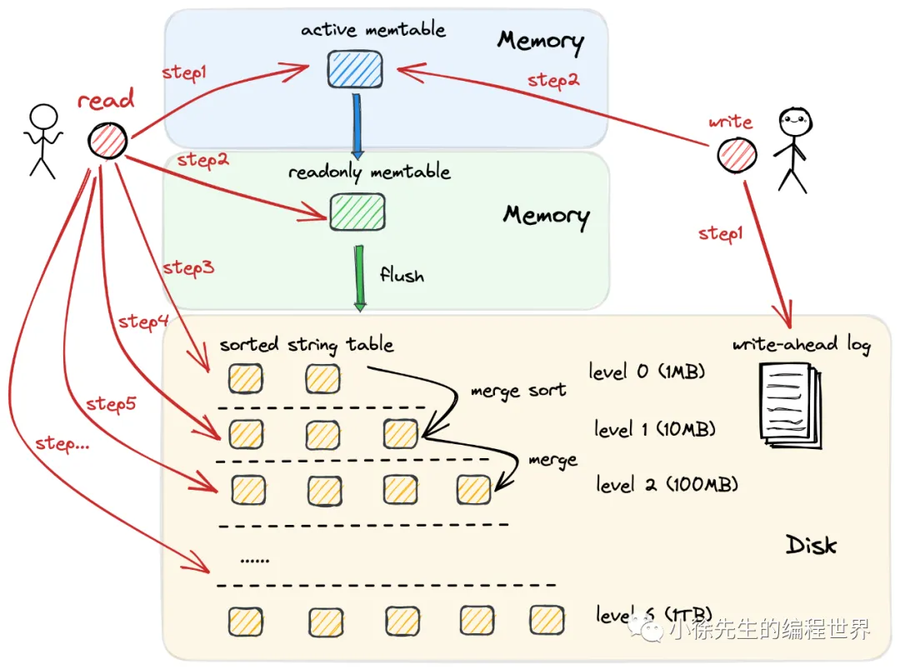
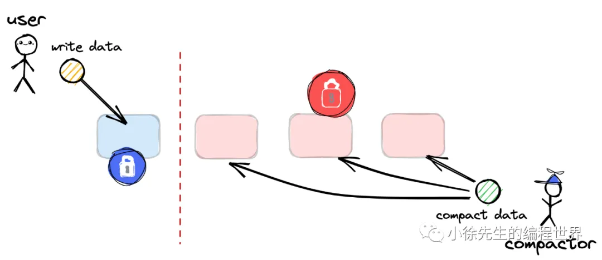
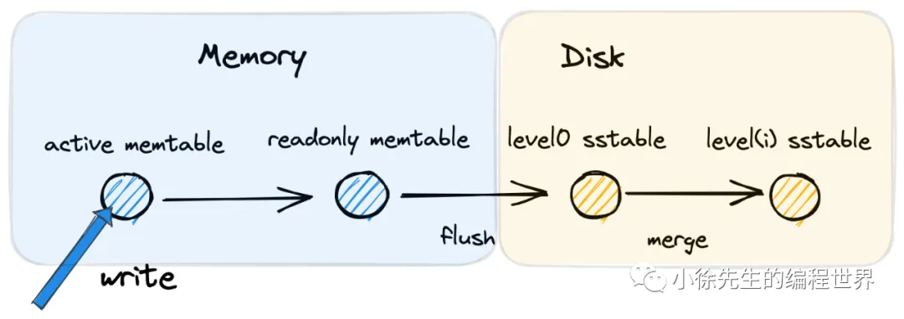
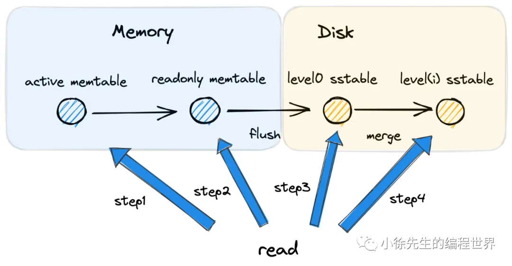

## 背景

1. 读多写少、写多读少
2. 原地写、追加写
   追加写策略在提升写操作效率的同时，所付出的代价是导致同一组 kv 对可能产生多份冗余数据.因此追加写策略下的读流程性能是比较差的.
3. rocksdb

## lsm tree

1. 追加写存在的问题
2. 数据合并+文件分块
   
   写操作只会追加到最新的 new table 中，而异步的压缩合并操作则只面向于老文件 old table，这样两个流程之间就能够实现解耦，写操作不再有陷入阻塞的风险，同时压缩操作和写操作之间也能存在清晰明确的界限
3. 数据有序存储
4. 内存+磁盘

   - 内存是易失性存储，倘若 memtable 在溢写磁盘前就宕机，那么导致的数据丢失问题如何解决？
     预写日志
   - 在 memtable 溢写磁盘的过程中，外部的写操作需要阻塞，所带来的性能问题如何解决？
     “金蝉脱壳”，转化为只读memtable，建立一个全新空白的 active memtable，作为写操作的新入口，写操作不再需要阻塞
   - memtable 作为有序存储结构，内部采用什么样的数据结构进行实现？
     跳表：更简单的实现(容易调试、扩展功能)、`更细的并发锁粒度`

     红黑树由于自身染色的机制，每次写操作时都需要对对整棵树的（全量数据）进行加锁，相对笨重；
     而跳表则不同，在执行写操作时，可以只针对插入节点局部范围内以及对跳表全局最大高度进行加锁，拥有着更细的锁粒度，在很多场景中是可以做到并发写的.

5. 预写日志
   WAL 和 memtable 可以建立对应关系，每当一个 memtable 被溢写到磁盘中成为 disktable，其发生数据丢失问题的风险也就随之消除，因此对应的 WAL 也就可以删除了. 并且，由于 WAL 中也是追加写的操作，属于磁盘顺序 IO，因此性能不会成为瓶颈
6. 内存读写+只读分层
7. 磁盘分层
   • disktable 内部不存在重复 kv 对数据，因为 memtable 执行的是就地写操作
   • disktable 内部的 kv 对数据是有序的，因为 memtable 数据本身就是有序的

   - level0 是特殊的，其中 disktable 之间可能存在冗余的 kv 对数据且不保证全局有序，因为其数据来自 memtable
   - level1~levelk 中单层之内没有冗余的 kv 对数据，且保证全局有序
   - 不同 level 层之间可能存在冗余的 kv 数据
   - 较热（最近写入）的数据位于浅层，较冷（更早写入）的数据位于深层
   - levelk 作为最深的一层，整体沉淀的数量达到全局的百分之九十左右

8. sstable
   `分块 + manifest记录每个sstable的minmax + bloomfilter`

   • 首先 sstable 内部会进一步将 table 拆分为多个 block 块，其在逻辑意义上从属于同一个 sstable；
   • 其次，sstable 中会额外维护一个索引信息，其中记录了每个 block 的 k_min 和 k_max 以及每个块中各行的 k_max 和 k_min，便于辅助的查询操作
   • 此外，lsm tree 还维护着一个全局索引信息，记录着不同 level 中，每个 sstable 对应的k_max 和 最小 k k_min 的范围
   • 最后，每个 sstable 还维护着一个布隆过滤器 bloomfilter，用于快速判断一个 k 是否存在于当前 sstable 中.

## lsm tree 读写流程

1. 写流程
   
   基于就地写模式，写入内存中的 active memtable
   active memtable 达到阈值后转为只读的 readonly memtable
   readonly memtable 会 flush 到磁盘，成为 level0 的 sstable
   level(i) 层数据容量达到后，会基于归并的方式合并到 level(i+1)，以此类推

2. 读流程
   
   • 尝试读 active memtable
   • 尝试读 readonly memtable
   • 尝试`读 level0，需要按照溢写顺序进行倒序，依次读 level0 中的每个 sstable（level0 sstable 间数据可能冗余）`
   • 根据全局的索引文件，`依次读 level1~levelk，每个 level 最多只需要读一个 sstable`
   • 读一个 sstable 时，借助内部的 bloom filter 和索引，加速查询流程

综上所述，在 lsm tree 架构下，一次读操作可以在常数级别的 IO 次数下完成，同时每次 IO 操作中则需要承受对应 table 内数据量对数级别的查询时间复杂度.
