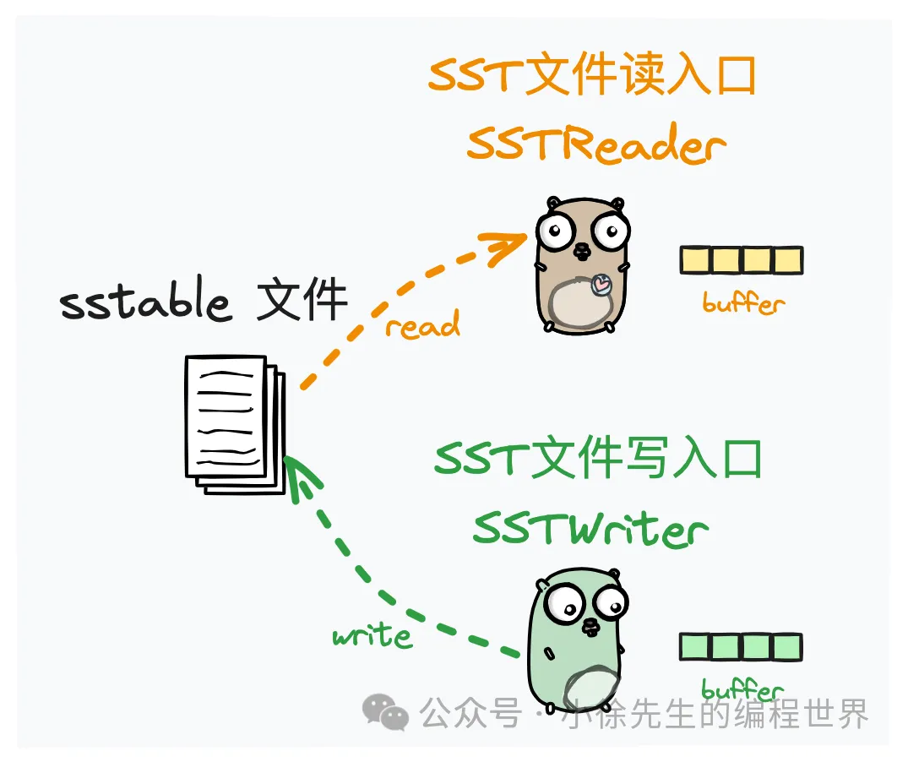

https://mp.weixin.qq.com/s?__biz=MzkxMjQzMjA0OQ==&mid=2247484876&idx=1&sn=8514ad4dc0cc63bc5d193a194e81d7b6

## 核心数据结构

1. Conf
2. Tree
3. Node
   lsm tree 中的一个节点. 对应一个 sstables
4. Block
   每个 sstable 文件均以数据块 block 的形式进行数据分组. 后续无论是索引 index 还是过滤器 filter，都是与 block 对应存在的.
5. SSTable
   

   - sstWriter
     对应为一个 sstable 文件的写入口
   - sstReader
     对应为一个 sstable 文件的读取器

6. Index

   索引 index 是在逻辑意义上是插入在 `sst 文件各个 dataBlock 之间的记录桩点`
   • key：需要保证大于等于前一个 dataBlock 中的最大 key，小于后一个 dataBlock 中的最小 key
   • PrevBlockOffset：对应为前一个 dataBlock 起始位置在 sstable 文件的 offset
   • PrevBlockSize：对应为前一个 dataBlock 的大小，单位 byte

7. MemTable
   lsm tree 中使用的内存有序表，此处声明为一个 interface，使用方可以根据需要实现具体的版本进行注入
8. Filter
   sstable 文件中针对每个 block 使用的过滤器，用于辅助快速判断一个 key 是否可能存在于某个 block 块中.

## 启动流程
