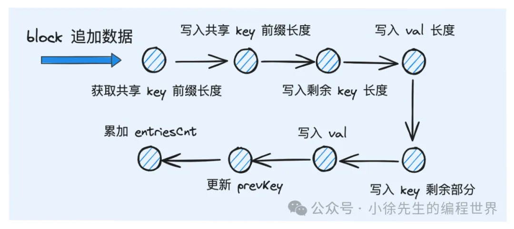

## 原理概述

1. sstable 文件三个主要部分：data block、filter block、index block
   
2. data block
   在 block 中，由于 kv 数据的长度是不确定的，为实现不同 kv 数据之间的分隔，采用的方式是通过 header 额外标识每组 kv 对的数据长度：
   具体而言，此处会采用`固定的 bit 位作为 header 标识，形式如下：`
   【key 长度】 -> 【val 长度】-> 【key】->【val】

   此外，又因为 sstable 中数据 key 是有序的，因此`相邻 key 之间有很大概率可以复用共同的前缀，因而在实现形式上可以进一步优化`：
   【与前一个 key 共享前缀长度】 -> 【key 剩余部分长度】->【val 长度】-> 【key 剩余部分】->【val】

   

3. filter block
   `为减少不必要的磁盘 io ，针对每个 block 在内存维护一个 filter 。`
   保存 block 内部的 key 集合，用于`快速判断key是否不存在于block中`，从而避免不必要的 block 读取
4. index block
   
   在各 block 之间设定桩点，存储(key,preBlockOffset,preBlockSize)。
   读流程中，可以先通过 index 快速定位到数据可能存在的 block，再基于 block 的粒度展开详细的数据检索流程。

## block 实现

1. 数据结构
2. 追加数据
   
3. 导出数据
   当 block 内数据大小达到阈值或者写流程结束时，block 内的数据会被整合到 sstable 的全局 data buffer 中

## filter 实现

- 一个 bloom filter 实例对应 sstable 中的一个 data block
- 根据 m（预期的 bitmap 长度）和 n（当前已有的数据 key 数量）推导出合适的 k（hash 函数个数）【这里最佳公式为 `k = ln2 * m / n`，具体参见——布隆过滤器原理篇】

## sstWriter 实现

用于写 block -> 缓冲区 -> 磁盘

1. 数据结构
2. 追加数据
   - 每启用一个空白的 dataBlock，需要添加新的索引桩点
3. 溢写落盘
   dataBuf、filterBuf、indexBuf、footer
   footer，记录各个 buf 起始、大小、索引块起始、大小，用于读取时的定位

## sstReader 实现

1. 数据结构
2. 读取 footer
   读取数据前，需要先读取 footer 信息，获取到过滤器和索引部分的元数据信息
3. 读取 index
4. 读取 filter
5. 读取 kv 数据

   一大堆 read...

## 主流程串联

1. 读流程
2. memtable 落盘
3. sstable 排序归并
4. lsm tree 复原
