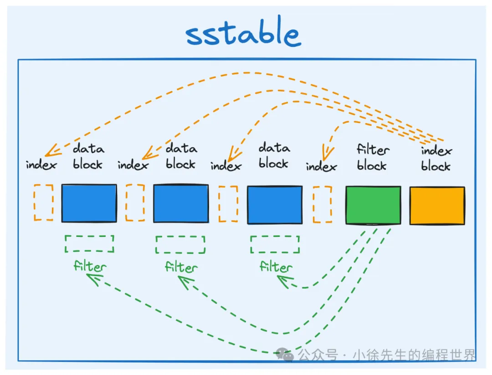
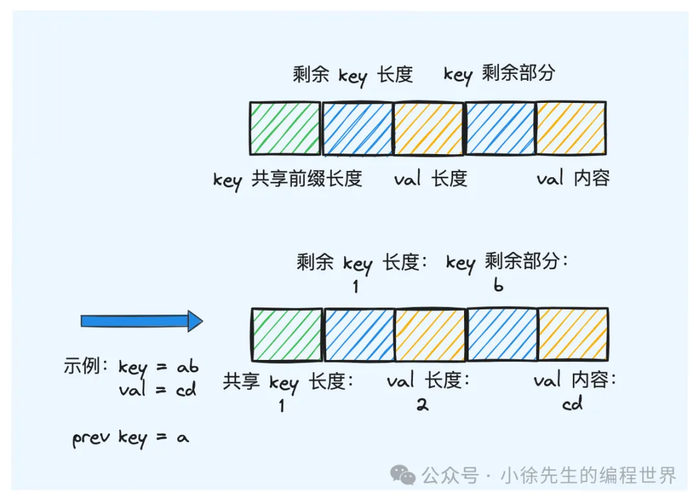
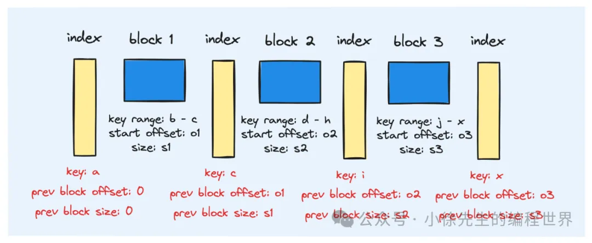

## 原理概述

1. sstable 文件三个主要部分：data block、filter block、index block
   
2. data block
   在 block 中，由于 kv 数据的长度是不确定的，为实现不同 kv 数据之间的分隔，采用的方式是通过 header 额外标识每组 kv 对的数据长度：
   具体而言，此处会采用`固定的 bit 位作为 header 标识，形式如下：`
   【key 长度】 -> 【val 长度】-> 【key】->【val】

   此外，又因为 sstable 中数据 key 是有序的，因此`相邻 key 之间有很大概率可以复用共同的前缀，因而在实现形式上可以进一步优化`：
   【与前一个 key 共享前缀长度】 -> 【key 剩余部分长度】->【val 长度】-> 【key 剩余部分】->【val】

   

3. filter block
   `为减少不必要的磁盘 io ，针对每个 block 在内存维护一个 filter 。`
   保存block内部的key集合，用于`快速判断key是否不存在于block中`，从而避免不必要的block读取
4. index block
   
   在各 block 之间设定桩点，存储(key,preBlockOffset,preBlockSize)。
   读流程中，可以先通过 index 快速定位到数据可能存在的 block，再基于 block 的粒度展开详细的数据检索流程。

## block 实现
