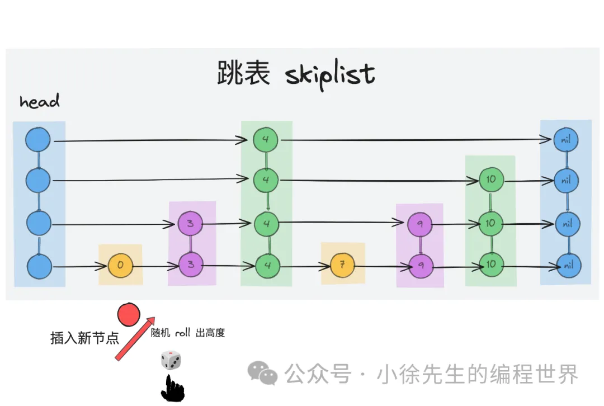
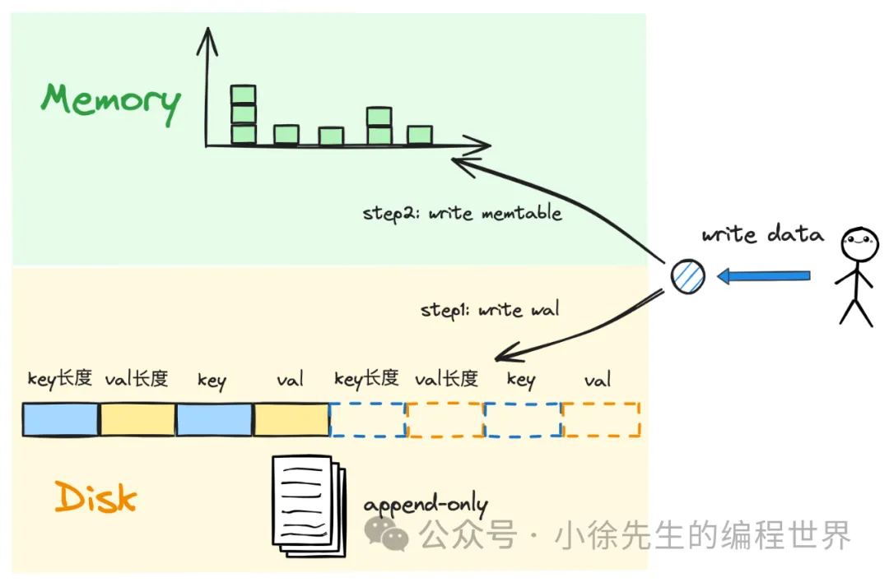
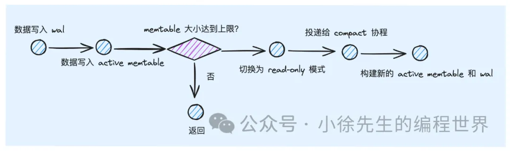
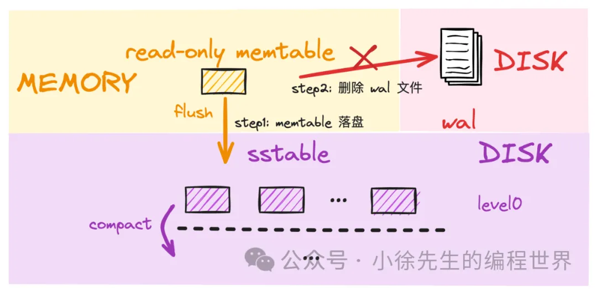
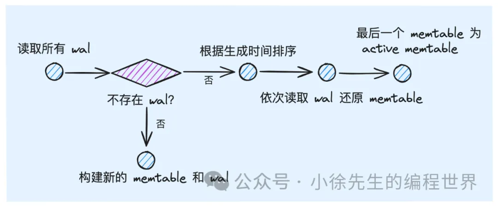
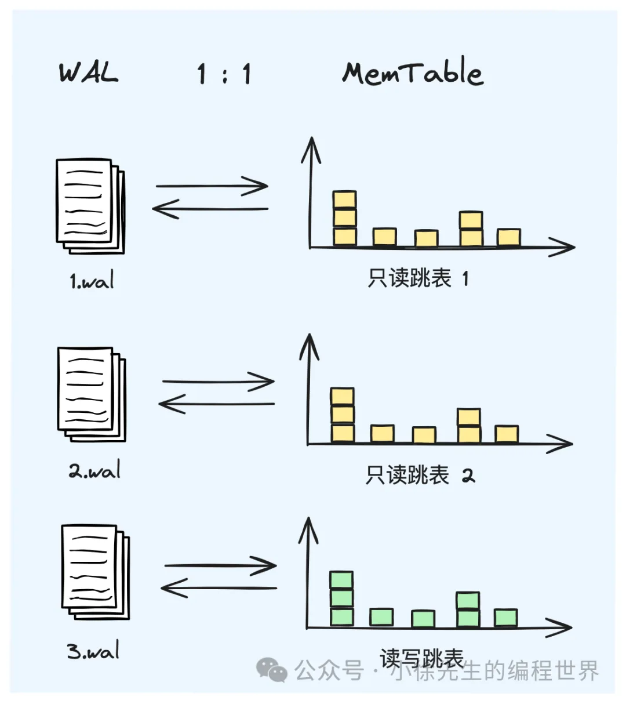

## memtable & wal

1. memtable 定位
2. memtable 选型
   
   跳表实现难度低于红黑树
   跳表支持范围查询
   跳表具有更好的并发性能
3. skiplist 实现原理
   跳表的”跳“字体现在，每跳过一个高层节点，实际上都`过滤跳过了底层的大量数据`，从而实现检索加速
4. wal 定位
   避免易失性存储的 memtable 出现数据丢失，保留基于 wal 恢复 memtable 数据的能力。
   
   在 wal 文件中，会基于【key长度】-【value长度】-【key内容】-【value内容】的形式完成内容存储，以实现不同 kv 对的数据分隔.

## memtable实现

1. 接口
2. skiplist 数据结构

## wal 实现

1. walWriter
   采用【key长度】-【value长度】-【key内容】-【value内容】的形式完成内容的存储，读取时也采用同样的协议解析即可.

   ```go
   // 写入一笔 kv 对到 wal 文件中
   func (w *WALWriter) Write(key, value []byte) error {
   	// 首先将key 和 value 长度填充到临时缓冲区 assistBuffer 中
   	n := binary.PutUvarint(w.assistBuffer[0:], uint64(len(key)))
   	n += binary.PutUvarint(w.assistBuffer[n:], uint64(len(value)))

   	// 依次将 key 长度、val 长度、key、val 填充到 buf 中
   	var buf []byte
   	buf = append(buf, w.assistBuffer[:n]...)
   	buf = append(buf, key...)
   	buf = append(buf, value...)
   	// 将以上内容写入到 wal 文件中
   	_, err := w.dest.Write(buf)
   	return err
   }
   ```

2. walReader
   一个 wal 文件对应一个 memtable 的全量数据.
   RestoreToMemtable 方法用于读取 wal 文件的全量内容，将所有 kv 对写入到 memtable 当中.
   遵循数据格式，每次采用【key长度】-【value长度】-【key内容】-【value内容】的协议完成一组 kv 数据的读取，直到 wal 文件内容读完即可.

## memtable&wal 流程串联

1. 写流程
   
2. 落盘流程
   
3. 复原流程
   
   lsm tree 重启时，通过已有的 wal 文件还原出一系列 memtable 的复原流程
   
