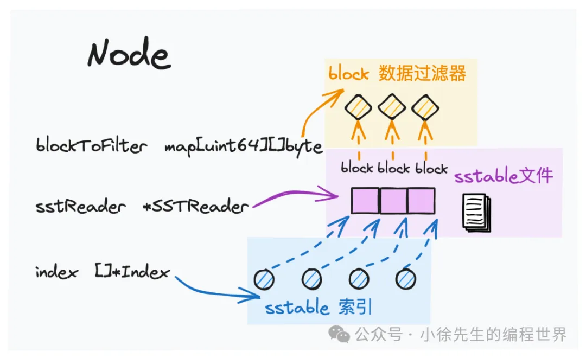
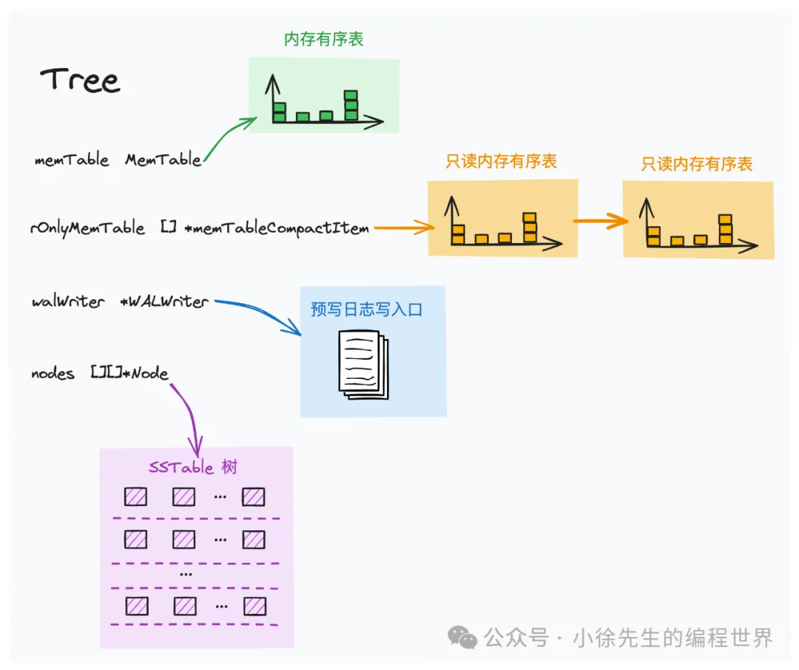

# 实现篇四：基于 go 实现 lsm tree 之 level sorted merge 流程

## 流程介绍

1. lsm compact 机制

   - 内存有序表 memtable 的数据溢写生成 level0 的 sst 文件，因此 `level0 层文件局部有序，文件间可能重复且无序`
   - 数据从 level(i) 流向 level(i+1) 过程中，`通过 compact 操作，数据去重和排序，保证汇入 level(i+1) 层后数据无重复且全局有序`

2. lsm compact 示例
   某时刻，lsm tree 中 level1 层的数据容量达到阈值，接下来要发起 level(1) -> level(2) 的归并操作

   - 从 level1 中选取一个本轮 comact 的数据范围 [0-30]（此处选取范围的规则比较灵活）
   - 查找到 level2 层与 [0-30] 有重叠的 sst 文件——[0-10] 和 [11-32]

## 核心模块

1. Node
   Node 是 lsm tree 拓扑结构中对应于一个 sst 文件的节点. Node 中一方面记录了其在 lsm tree 中的拓扑信息，如层级以及序号，另一方面通过持有 sstReader、文件索引 index、块过滤器 filter 等成员属性，能够很好地支持 sst 文件的数据检索操作.
   
2. Tree
   Tree 对应的就是一棵 lsm tree 实例，其中维护了内存读写有序表 memtable 以及一系列内存只读有序表 rOnlyMemtable，并通过一个二维数组 nodes 实现了磁盘下多层级 sst 文件的拓扑结构.
   
3. compact 协程
   在一棵 lsm tree 实例启动时，会异步启动一个 compact goroutine，持续负责为只读 memtable 完成溢写落盘操作，以及为各 level 层完成 compact 操作.

## memtable 落盘

## level compact 流程
